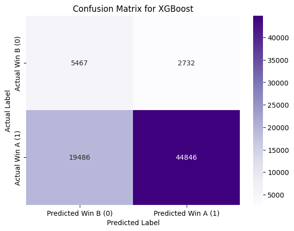
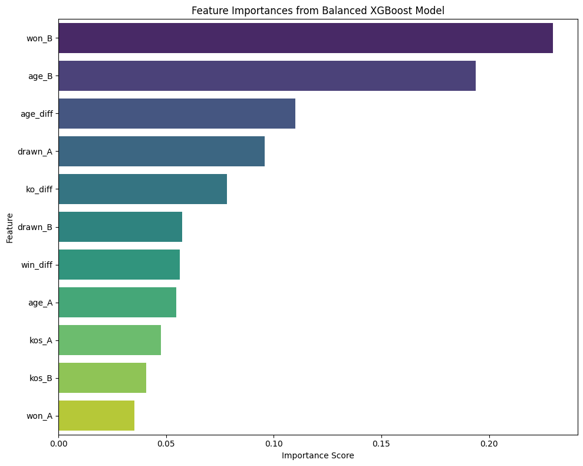

# Predicting-Boxing-Match-Outcomes-using-Machine-Learning

## Introduction & Goal

Following an initial exploratory data analysis (Project 1), this project focuses on building and evaluating machine learning models to predict the winner of professional boxing matches using the large dataset (~387k bouts prior to cleaning for this task) sourced from Kaggle. The primary objective was to classify outcomes as 'Win A' or 'Win B' based on available pre-fight fighter statistics, aiming to identify factors predictive of success. A significant challenge addressed during this project was the inherent class imbalance present in the historical outcomes, requiring specific techniques for model training and more nuanced evaluation beyond simple accuracy. Several classification models, including Logistic Regression, Random Forest, and XGBoost, were trained and compared to determine an effective approach for this prediction task while accounting for the data imbalance.

## Data Source & Tools

* **Data Source:** This project utilized the "Boxing Matches" dataset sourced from Kaggle ([https://www.kaggle.com/datasets/mexwell/boxing-matches](https://www.kaggle.com/datasets/mexwell/boxing-matches)), the same dataset explored in Project 1, containing historical data on approximately 387,000 professional boxing bouts before cleaning for this task.
* **Tools Used:**
    * Python
    * Pandas (for data loading, manipulation, and cleaning)
    * NumPy (for numerical operations and outlier handling)
    * Scikit-learn (for preprocessing `StandardScaler`, `train_test_split`; models `LogisticRegression`, `RandomForestClassifier`; and evaluation metrics like `accuracy_score`, `confusion_matrix`, `classification_report`, `roc_auc_score`)
    * XGBoost (for the `XGBClassifier` model)
    * Matplotlib & Seaborn (for data visualization, including confusion matrices and feature importances)
    * Google Colab (as the development environment)

  ## Data Preparation & Feature Engineering

The process to prepare the data for predictive modeling involved several key steps:

1.  **Initial Cleaning:** Building on Project 1, outliers in physical attribute columns (age, height, weight, reach) were handled by capping values to realistic ranges (e.g., age 16-50).
2.  **Target Variable Creation:** Matches resulting in a 'draw' were filtered out from the dataset to focus on decisive outcomes. A binary target variable (`target`) was then created, assigning '1' to fights won by Fighter A (`result == 'win_A'`) and '0' to fights won by Fighter B (`result == 'win_B'`).
3.  **Feature Selection:** An initial set of pre-fight features was selected for both competitors, including their age, win record, loss record, draw record, and knockout record (`age_A/B`, `won_A/B`, `losses_A/B`, `drawn_A/B`, `kos_A/B`).
4.  **Feature Engineering:** To capture comparative fighter strength and attributes, several difference-based features were engineered: `age_diff`, `win_diff`, `loss_diff`, `ko_diff`, and `exp_diff` (experience difference based on total fights).
5.  **Missing Value Imputation:** Missing values remaining within the selected feature set (primarily affecting `age_A`, `age_B`, and `kos_B`) were imputed using the median value calculated from the available data in each respective column. Difference features dependent on these columns (`age_diff`, `ko_diff`) were recalculated post-imputation.
6.  **Train/Test Split:** The processed features (`X`) and the binary target (`y`) were split into training (80%) and testing (20%) sets. Stratification based on the target variable (`stratify=y`) was used to ensure the significant class imbalance (~89% Win A vs. ~11% Win B) was reflected proportionately in both sets.
7.  **Feature Scaling:** Finally, all numerical features in both the training (`X_train`) and testing (`X_test`) sets were scaled using Scikit-learn's `StandardScaler`. This step standardizes features to have zero mean and unit variance, which is beneficial for algorithms like Logistic Regression.

## Modeling & Evaluation

The goal of the modeling phase was to predict the binary outcome of a boxing match (Win A = 1, Win B = 0) using the prepared pre-fight features. Given the significant class imbalance identified in the data (~89% Win A vs. ~11% Win B), model evaluation focused not just on overall accuracy, but critically on metrics sensitive to imbalance, such as the AUC-ROC score and the Precision, Recall, and F1-score for the minority class ('Win B').

Several classification models were trained and evaluated sequentially:

### 1. Balanced Logistic Regression

A Logistic Regression model was trained as a baseline, incorporating the `class_weight='balanced'` parameter to counteract the class imbalance. This model achieved an AUC score of **0.7103**. While it significantly improved the Recall for the minority 'Win B' class compared to an unbalanced approach (Recall = **0.63**), its Precision for this class remained low (Precision = **0.20**), indicating many false positives for 'Win B'. The overall F1-score for 'Win B' was **0.31**.

### 2. Balanced Random Forest

To explore if a non-linear model could better capture the complex relationships within the data, a Random Forest Classifier was trained, again utilizing the `class_weight='balanced'` parameter. This model achieved an improved AUC score of **0.7414**. The Random Forest presented a different trade-off for the minority 'Win B' class compared to the balanced Logistic Regression: Precision for 'Win B' increased to **0.48**, meaning when it predicted a 'Win B', it was correct more often. However, its Recall for 'Win B' dropped substantially to **0.17**, indicating it identified a much smaller proportion of the actual 'Win B' instances. The F1-score for 'Win B' with this model was **0.25**. While the AUC score showed better overall discriminatory power, the low recall for the minority class was a significant concern.

### 3. Balanced XGBoost (Best Performing Model)

To further explore potential improvements, an XGBoost (Extreme Gradient Boosting) classifier was trained. XGBoost is known for its high performance and includes parameters like `scale_pos_weight` to effectively handle imbalanced datasets, which was utilized here. This model yielded the highest AUC score among all models tested, achieving **0.7481**. 

For the minority 'Win B' class (target 0), the XGBoost model demonstrated the strongest performance:
* **Recall:** **0.67** (meaning it correctly identified 67% of the actual 'Win B' instances).
* **Precision:** **0.22** (meaning when it predicted 'Win B', it was correct 22% of the time).
* **F1-score:** **0.33** (the best balance of precision and recall for the minority class).

While the precision for 'Win B' remained modest, the significant recall and the overall highest AUC indicated that XGBoost provided the best discriminative power and ability to identify the minority class outcomes in this iteration. The confusion matrix below details its performance on the test set.

### Feature Importances (XGBoost)

To understand which factors most influenced the predictions of the best-performing model (XGBoost), feature importances were analyzed. The plot below shows the relative importance of each feature used in the model.

  

The analysis revealed that pre-fight statistics related to the opponent (Fighter B), specifically their number of wins (`won_B`) and age (`age_B`), were the two most influential features by a noticeable margin. The difference in age between the fighters (`age_diff`) also ranked highly, followed by Fighter A's draw record (`drawn_A`) and the difference in knockouts (`ko_diff`). This indicates the model heavily weighs the opponent's past success and age, along with the age disparity between competitors, when predicting fight outcomes based on this dataset.

## Limitations

Several limitations should be considered for this predictive modeling project. The dataset exhibited a significant class imbalance (approximately 89% 'Win A' vs. 11% 'Win B'), which, while addressed with techniques like `scale_pos_weight` in XGBoost and `class_weight='balanced'` in other models, still makes achieving high precision and recall for the minority class ('Win B') challenging. The features selected, primarily based on age and historical fight records, may not capture the full complexity of boxing dynamics, such as specific fighter styles, recent training camp quality, or in-fight adaptability. Furthermore, the absence of geographical data (confirmed missing) and other potentially rich features like detailed punch statistics or betting odds limits the potential predictive power of the models. The methods used for handling missing values (outlier capping and median imputation for age/KOs) are standard but introduce some level of approximation.

## Conclusion

This project successfully demonstrated an end-to-end machine learning workflow to predict professional boxing match outcomes from a large, imbalanced dataset. After thorough data preparation, feature engineering, and an iterative modeling process comparing Logistic Regression, Random Forest, and XGBoost, a balanced XGBoost classifier emerged as the best-performing model. It achieved an AUC score of approximately 0.748, showcasing a fair ability to distinguish between winners and losers, and notably improved the recall for the minority 'Win B' class to around 67% (F1-score ~0.33).

Feature importance analysis from the XGBoost model highlighted that the opponent's pre-fight win record (`won_B`), opponent's age (`age_B`), and the age difference between fighters (`age_diff`) were among the most influential predictors. While predicting sports outcomes is inherently difficult due to numerous unquantifiable variables, this project provides a solid baseline and highlights the importance of addressing class imbalance. Potential future work could involve incorporating more diverse features (if available), more extensive hyperparameter tuning, or exploring advanced ensemble techniques to refine predictive accuracy further.

## Code

The full analysis code and detailed steps can be found in the Jupyter Notebook file in this repository:
[`Boxing-Prediction-Project.ipynb`](Boxing-Prediction-Project.ipynb)
